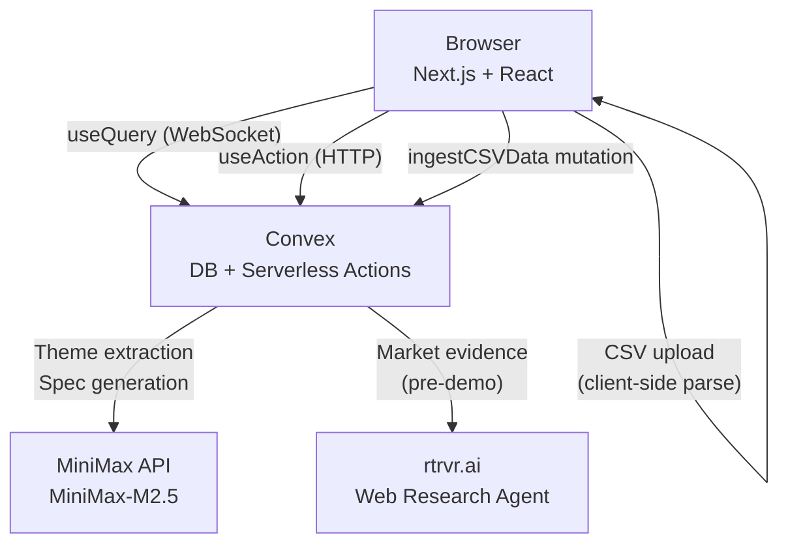
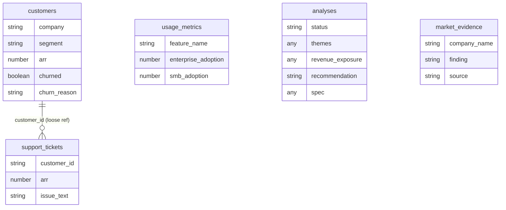
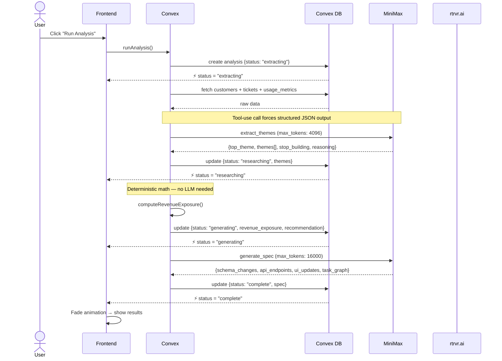
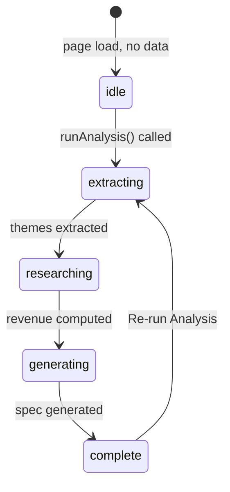
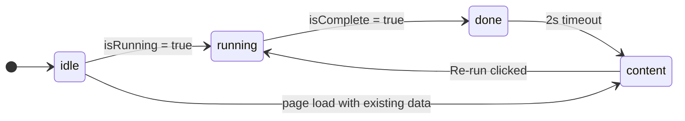
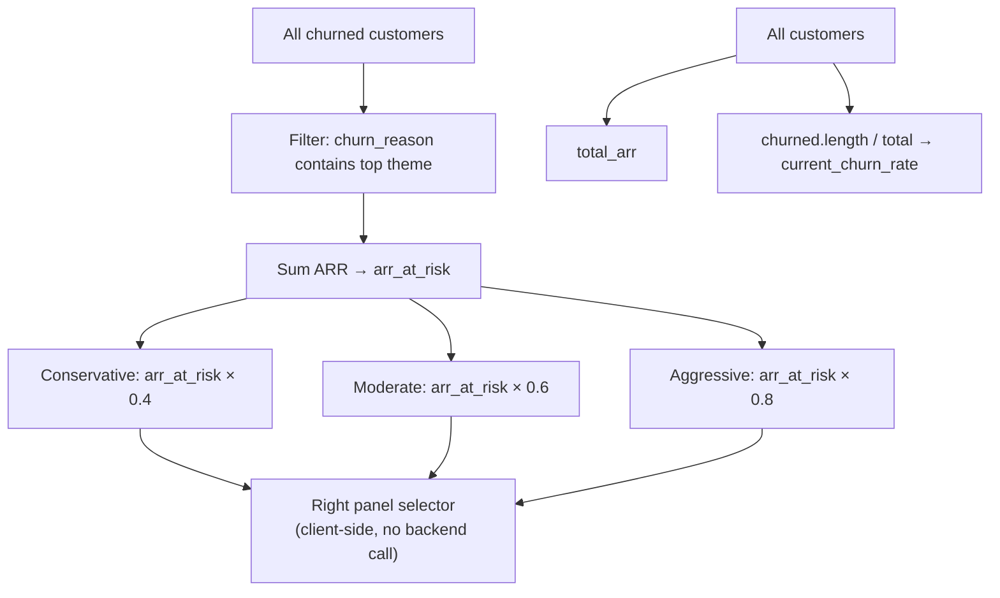
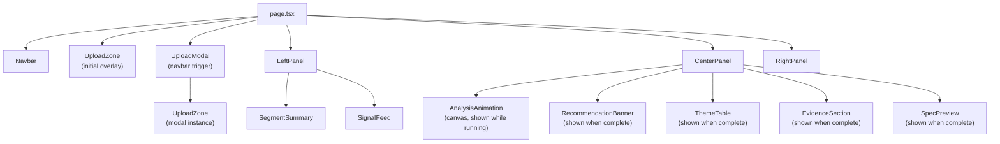
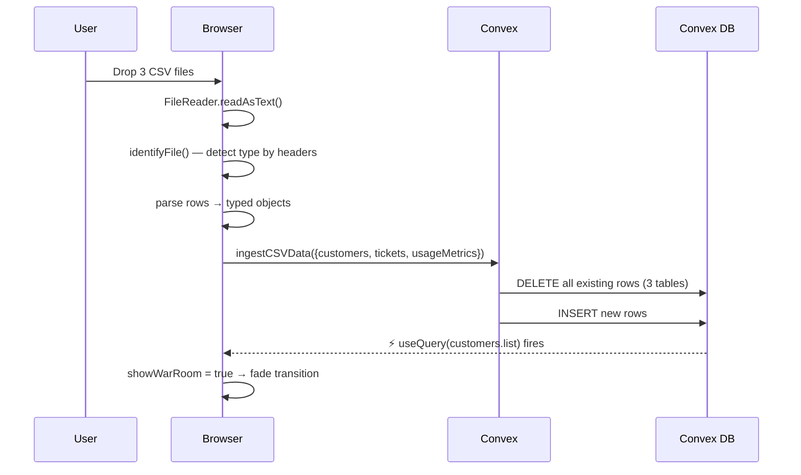
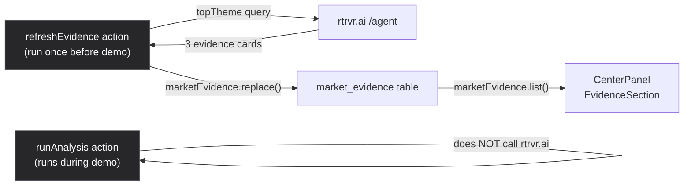

# Architecture

## Overview

Vector is a two-tier application: a **Next.js frontend** and a **Convex backend**. Convex acts as both the database and the serverless compute layer — it runs the AI pipeline, stores all state, and pushes updates to the frontend in real time via WebSocket subscriptions.

The frontend never calls external APIs directly. All LLM calls and web research go through Convex actions, which keeps API keys server-side and allows the frontend to react to state changes without polling.

---

## Data model

Five tables in Convex. No foreign key constraints — relationships are implicit.

`analyses` is written progressively — fields are added as each pipeline step completes. The frontend subscribes to `getLatest` and re-renders as new fields arrive.

---

## Analysis pipeline

The pipeline runs as a single Convex action (`runAnalysis`) that orchestrates three external calls and four database writes. Each write updates `status`, which the frontend observes in real time.

### Why `max_tokens: 16000` for spec generation?

The spec includes a nested `task_graph` (epics → stories → subtasks). MiniMax serializes nested arrays as JSON strings inside tool_use output. At `4096` tokens the string gets truncated, causing a silent `JSON.parse` failure. `16000` gives enough headroom for a full spec.

---

## Analysis status state machine

Frontend phase management mirrors this but adds a `done` buffer state — when the pipeline hits `complete`, the ASCII animation holds for 2 seconds before fading out to reveal the results panel.

---

## Revenue exposure model

Revenue math is deterministic — no LLM involved. Computed synchronously inside the Convex action.

The theme matching uses substring search on `churn_reason`, with special-cased synonyms for common patterns (e.g. `"sso"` also matches `"saml"`, `"single sign"`, `"security"`).

---

## Frontend component tree

`CenterPanel` manages a `phase` state (`idle → running → done → content`) that determines which of `AnalysisAnimation` and the results stack is visible. Both are always mounted; opacity transitions between them.

---

## Data flow: CSV upload

CSV files are parsed entirely in the browser — no file is sent to any server. Only the parsed JSON rows are sent to Convex.

File type is detected by inspecting the CSV header row — no filename matching needed. This means files can be named anything as long as the columns are correct.

---

## Market evidence: live vs. cached

rtrvr.ai web research runs as a separate action (`refreshEvidence`) so it can be pre-cached with the freshest results before a session. This keeps the main analysis pipeline fast while ensuring the evidence cards always reflect up-to-date market data.

If `refreshEvidence` hasn't been run, the table falls back to seed data (Linear, Notion, Figma SAML SSO examples seeded by `seedMarketEvidence`).
